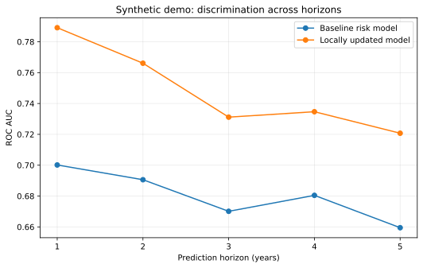
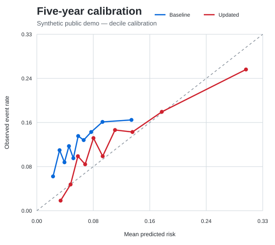
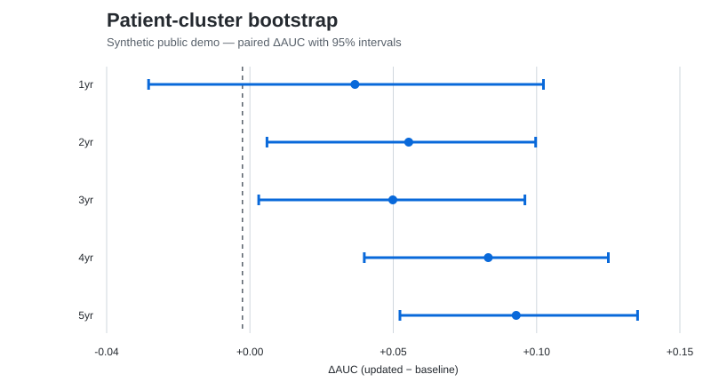
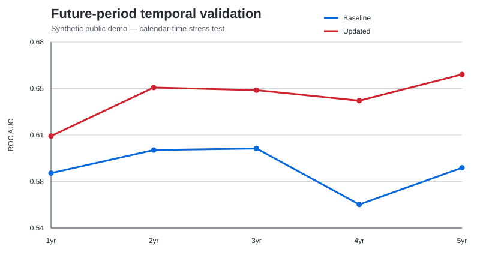

# Healthcare Risk Model Validation

**Public-safe reconstruction of an external validation and local adaptation workflow for mammography-based breast cancer risk prediction.**

The underlying work originated in a UBC Master of Data Science capstone with BC Cancer and was later extended independently into local model updating, calibration-method comparison, bootstrap uncertainty, temporal validation, feature-availability auditing, and robustness analysis. This repository reconstructs that analytical workflow with synthetic data and a generic feature schema.

> **Public boundary:** no patient-level BC Cancer data, internal field mappings, original private scripts, internal technical-manual text, or private result tables are included.

## Project at a glance

| Area | Scope |
|---|---|
| Prediction task | 1–5 year cumulative breast cancer risk |
| Validation design | horizon-specific follow-up eligibility, cumulative endpoints, patient-level splitting |
| Evaluation | ROC AUC, Brier score, E/O ratio, calibration intercept/slope, decile calibration |
| Local adaptation | logistic updating and LightGBM using fixed baseline risk predictions + pre-screen structured variables |
| Uncertainty / robustness | patient-cluster bootstrap, subgroup analysis, first-exam-only sensitivity |
| Transportability | future-period temporal validation |
| Prediction-time control | explicit pre-screen vs post-screen feature-availability audit |
| Secondary branch | separate post-screen short-horizon triage analysis |

## Private-project context

The private retrospective analysis used a large provincial screening cohort with **up to approximately 438,000 screening exams** across 1–5 year horizons. In the independent exploratory extension, the best observed held-out local-adaptation AUCs ranged from approximately **0.774 to 0.835**, with larger random-split gains contracting to approximately **+0.007 to +0.017** under future-period temporal validation.

Those figures are project context only. The runnable outputs in this repository are generated from synthetic data and are **not** intended to reproduce private BC Cancer result tables.

The private exploratory analysis also compared multiple model, calibration, and blending choices on held-out data. Accordingly, those headline values should be interpreted as **observed exploratory held-out performance**, not as a single pre-locked model evaluated once on an untouched test set. The public reconstruction implements a cleaner locked-test workflow described in [`docs/evaluation_protocol.md`](docs/evaluation_protocol.md).

## Analytical workflow

```text
Synthetic longitudinal screening cohort
        │
        ├─ cumulative 1–5y outcomes
        ├─ horizon-specific follow-up eligibility
        └─ patient-level train / validation / test split
        │
        ▼
External validation of fixed baseline risk predictions
        │
        ├─ discrimination
        ├─ calibration
        └─ probability error
        │
        ▼
Prediction-level local model updating
        │
        ├─ logistic updating
        ├─ LightGBM
        └─ validation-only model / calibration selection
        │
        ▼
Locked test evaluation
        │
        ├─ patient-cluster bootstrap
        ├─ subgroup robustness
        ├─ first-exam-only sensitivity
        ├─ decision-curve analysis
        └─ future-period temporal validation

Post-screen imaging/result variables are isolated in a separate triage branch.
```

## Why the validation design matters

The repository is organized around methodological decisions that materially affect healthcare model evaluation:

- **Repeated exams:** multiple screening exams from one patient are not independent observations, so splitting and bootstrap resampling operate at patient level.
- **Cumulative outcomes:** each horizon uses a cumulative event definition and its own follow-up eligibility rule.
- **Incomplete follow-up:** an exam is evaluated only when an event occurs within the horizon or sufficient follow-up is observed.
- **Calibration beyond AUC:** useful rank ordering does not guarantee accurate absolute risk probabilities.
- **Prediction-time leakage:** post-screen findings are blocked from the main pre-screen adaptation model.
- **Temporal stress testing:** future-period evaluation is used to test whether random-split gains transport across calendar time.

See [`docs/methodology.md`](docs/methodology.md) for the full public methodology.

## Public reconstruction outputs

All figures below are generated from the synthetic demo pipeline.

### Discrimination across horizons



### Calibration



### Patient-cluster bootstrap



### Future-period temporal validation



## Run the full demo

```bash
git clone https://github.com/<your-username>/healthcare-risk-model-validation.git
cd healthcare-risk-model-validation
python -m venv .venv
source .venv/bin/activate        # Windows: .venv\Scripts\activate
pip install -r requirements.txt
python run_all.py
```

The pipeline will:

1. generate a synthetic longitudinal screening cohort;
2. construct cumulative endpoints and follow-up eligibility;
3. evaluate the fixed baseline risk model;
4. select and calibrate local-updating models without using the test set for selection;
5. run paired patient-cluster bootstrap, subgroup, first-exam, decision-curve, and temporal analyses;
6. run the separate post-screen triage branch; and
7. regenerate the public figures and tables.

Run tests with:

```bash
pytest -q
```

## Repository structure

```text
healthcare-risk-model-validation/
├── README.md
├── requirements.txt
├── run_all.py
├── data/
│   ├── README.md
│   └── synthetic/
│       └── screening_demo_sample.csv
├── src/
│   ├── cohort.py
│   ├── synthetic.py
│   ├── metrics.py
│   ├── calibration.py
│   ├── modeling.py
│   ├── bootstrap.py
│   ├── temporal_validation.py
│   ├── leakage_audit.py
│   ├── subgroup.py
│   ├── decision_curve.py
│   ├── post_screen.py
│   └── plotting.py
├── scripts/
│   ├── 01_generate_synthetic_data.py
│   ├── 02_external_validation.py
│   ├── 03_local_adaptation.py
│   ├── 04_robustness.py
│   ├── 05_temporal_validation.py
│   ├── 06_post_screen_triage.py
│   └── 07_make_figures.py
├── results/
│   ├── tables/
│   └── figures/
├── docs/
│   ├── methodology.md
│   ├── public_boundary.md
│   ├── evaluation_protocol.md
│   ├── interpretation.md
│   └── limitations.md
└── tests/
```

## Interpretation boundary

This repository demonstrates **external validation and prediction-level local adaptation of fixed risk outputs**. It does **not** retrain or fine-tune the Mirai image network, claim clinical deployment, or represent an official BC Cancer model release.

The separate post-screen branch uses information available after the screening exam and therefore answers a different prediction-time question from the main pre-screen/general risk-updating workflow.

## My role

I implemented the analytical code and validation workflow for the capstone analysis and later independently extended the work into local adaptation, calibration-method comparison, robustness analysis, temporal validation, feature-availability audit, and this public-safe reconstruction.

## Additional documentation

- [`docs/methodology.md`](docs/methodology.md) — analytical design and method definitions
- [`docs/evaluation_protocol.md`](docs/evaluation_protocol.md) — locked-test public protocol and retrospective exploratory context
- [`docs/public_boundary.md`](docs/public_boundary.md) — what is and is not represented publicly
- [`docs/interpretation.md`](docs/interpretation.md) — model/task interpretation, including the post-screen branch
- [`docs/limitations.md`](docs/limitations.md) — limitations and non-claims
