# Analysis Gallery

All figures in this gallery are generated from **curated aggregate project-context tables**. They contain no patient-level records, no exam-level private predictions, and no internal BC Cancer field mappings. Synthetic runnable outputs live separately under `results/`.

## Original-style aggregate figures

These figures are static aggregate visual summaries from the private retrospective analysis. They preserve the visual evidence structure of the original project while keeping patient-level data, ROC coordinate tables, prediction rows, internal mappings, and private scripts out of the public repository.

### ROC curves across 1–5 year horizons

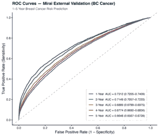

This figure shows the original external-validation ROC curves and horizon-specific AUC confidence intervals. It provides the clearest visual evidence of the baseline discrimination analysis.

### Decile calibration across 1–5 year horizons

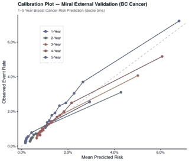

This figure shows grouped observed event rates against mean predicted risks. It demonstrates why calibration was evaluated separately from AUC.

### Subgroup AUC forest plot

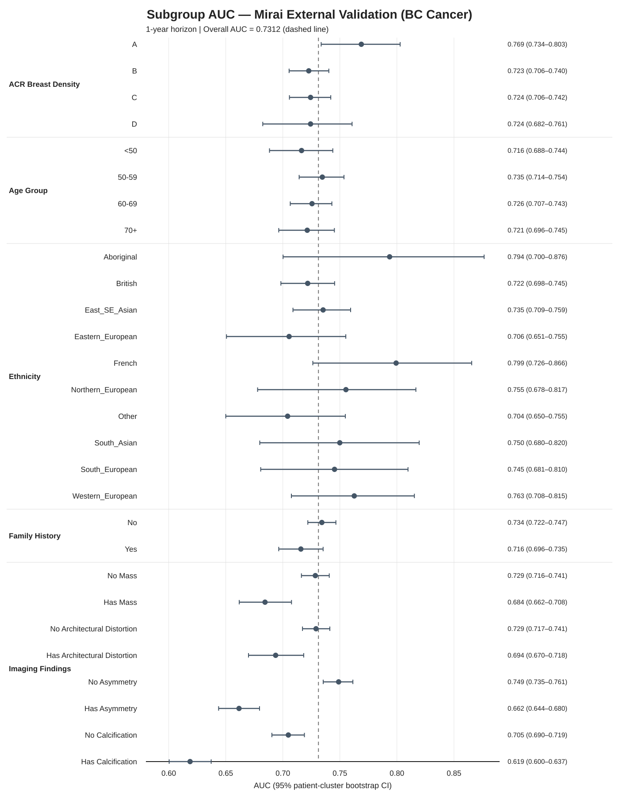

The subgroup forest plot summarizes descriptive discrimination heterogeneity across density, age, ethnicity, family history, and imaging-finding strata. It is not interpreted as causal evidence or as proof of clinical utility.

### First-exam-only sensitivity: AUC

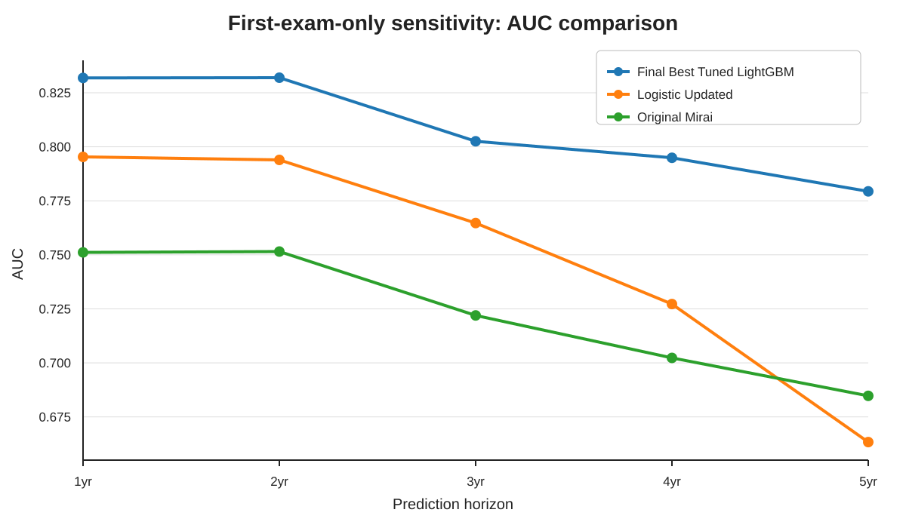

This analysis checks whether discrimination patterns persist after reducing repeated exams to one earliest observed exam per patient.

### First-exam-only sensitivity: Brier score

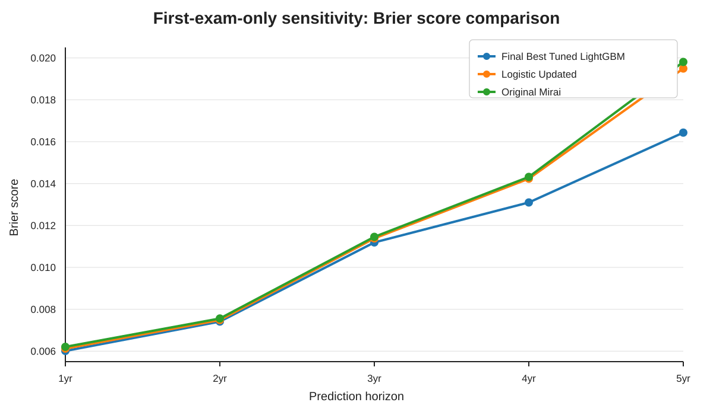

This companion figure evaluates probability error, not only ranking, under the first-exam-only sensitivity design.

## A. External validation

### A1. Original Mirai discrimination across 1–5 year horizons
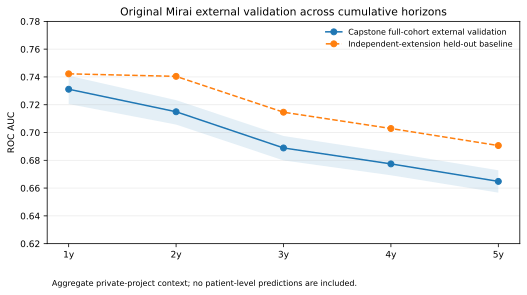

The capstone full-cohort external-validation context and the later independent-extension held-out baseline are shown separately. This avoids collapsing two different evaluation populations into one performance series.

### A2. Calibration burden across horizons
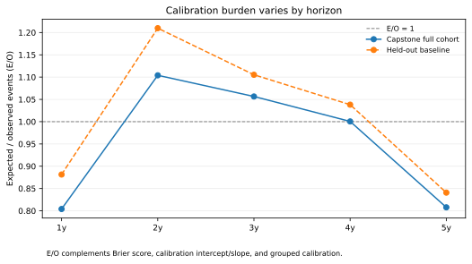

Expected/observed burden varies by horizon. E/O is interpreted together with Brier score, calibration intercept/slope, and grouped observed-versus-predicted risk.

### A3. Follow-up availability
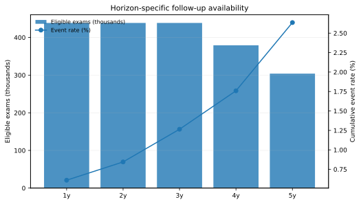

Eligibility declines at the longer horizons because later screening exams do not all have complete 4–5 year follow-up. This is why horizon-specific denominators are required.

### A4. Subgroup discrimination
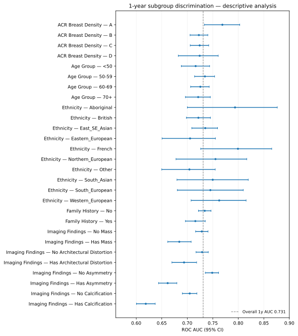

Subgroup AUC is descriptive and uncertainty is shown explicitly. Small groups with insufficient cases are excluded from the public forest rather than presented as stable estimates.

### A5. Imaging-finding deep dive
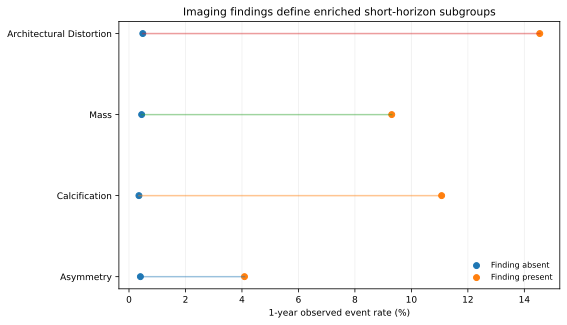

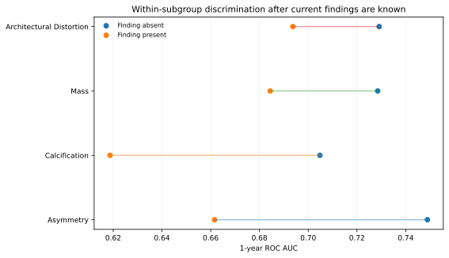

Current imaging findings identify strongly enriched short-horizon groups while also changing the within-group discrimination problem. This helped motivate a strict prediction-time boundary between general risk updating and post-screen triage.

## B. Local adaptation

### B1. Held-out AUC comparison
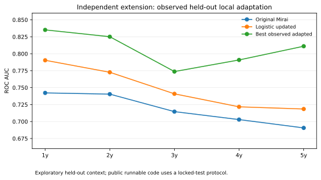

The independent extension compared Original Mirai, an interpretable logistic update, and stronger nonlinear local updating. The strongest values are reported as observed exploratory held-out performance.

### B2. Probability error
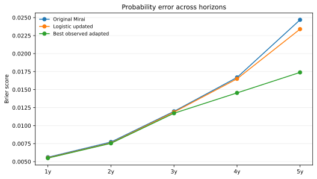

Brier score is tracked separately from ranking performance.

### B3. Aggregate calibration burden
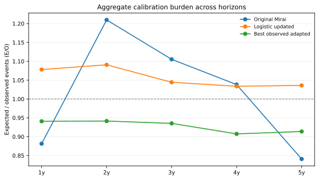

E/O provides a direct summary of predicted versus observed event burden.

### B4. Recalibration parameters
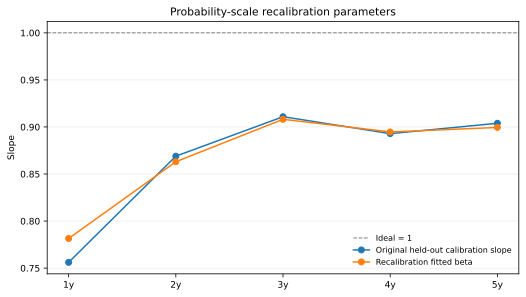

Monotonic recalibration corrects probability scale but does not create new ranking information.

## C. Robustness and transportability

### C1. Patient-cluster bootstrap
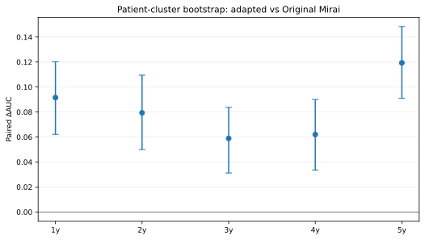

Paired bootstrap resampling occurs at patient level so repeated exams remain clustered.

### C2. First-exam-only sensitivity
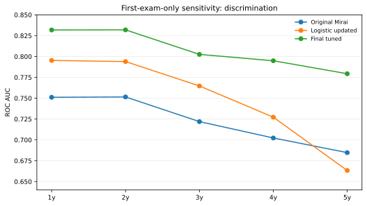

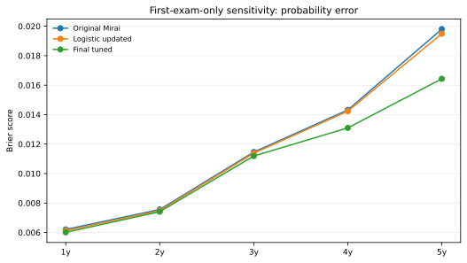

Reducing each patient to one earliest observed exam checks whether conclusions are driven only by repeated screening records.

### C3. Future-period temporal validation
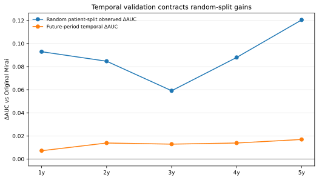

Random patient-split gains contract markedly when models are evaluated on later screening periods. This is a central interpretation result.

## D. Clinical-use-oriented analyses

### D1. High-risk case capture
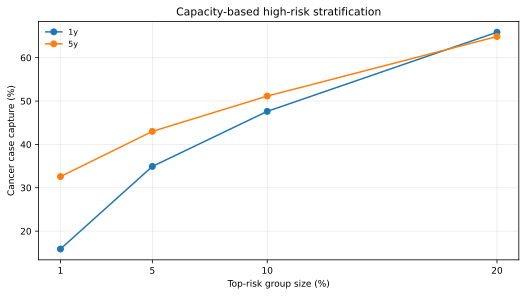

Capacity-based top-risk groups quantify concentration of observed cases without turning the analysis into a deployment recommendation.

### D2. Decision-curve summary
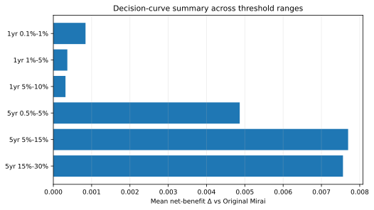

The figure summarizes retrospective net-benefit deltas over selected threshold ranges; it is not a prospective clinical-utility claim.

### D3. Post-screen triage
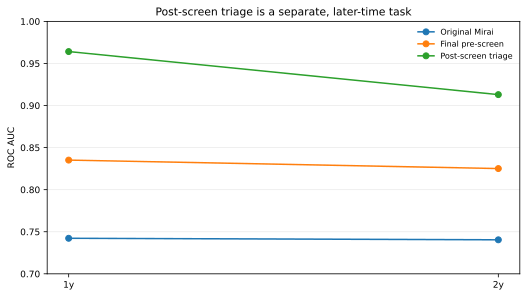

Current findings/result information is used only in this later-time branch together with horizon-specific Mirai risk. It answers a different question from the main pre-screen/general risk-updating workflow.
