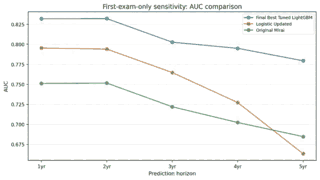
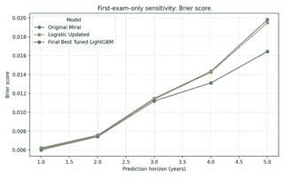

# Robustness and Transportability Evidence

## 1. Patient-cluster bootstrap

The modeling unit is an exam, but repeated exams from one patient are correlated. The paired bootstrap therefore resamples **patients**, carries all eligible exams from each sampled patient, and evaluates the baseline and adapted models on the same replicate.

| Horizon | Mean ΔAUC | 95% CI | Mean ΔBrier | 95% CI |
|---|---:|---:|---:|---:|
| 1 year | +0.0916 | +0.0621 to +0.1202 | -0.000137 | -0.000254 to -0.000036 |
| 2 years | +0.0794 | +0.0499 to +0.1095 | -0.000224 | -0.000347 to -0.000096 |
| 3 years | +0.0589 | +0.0312 to +0.0837 | -0.000246 | -0.000344 to -0.000163 |
| 4 years | +0.0620 | +0.0336 to +0.0900 | -0.002221 | -0.002867 to -0.001583 |
| 5 years | +0.1193 | +0.0910 to +0.1484 | -0.007314 | -0.008823 to -0.006109 |


The bootstrap supports stability of the paired improvement **within the held-out patient population**. It does not establish future-period transportability or performance at another institution.

## 2. Temporal future-period validation

Temporal validation is the central stress test in this project. It trains on earlier calendar periods and evaluates later eligible screening periods, asking whether local gains persist under calendar-time shift.

| Horizon | Temporal Original AUC | Temporal adapted AUC | ΔAUC | Test exams / cases |
|---|---:|---:|---:|---:|
| 1 year | 0.7237 | 0.7309 | +0.0072 | 136,950 / 885 |
| 2 years | 0.7169 | 0.7307 | +0.0138 | 136,950 / 1,210 |
| 3 years | 0.6850 | 0.6979 | +0.0129 | 136,950 / 1,846 |
| 4 years | 0.6751 | 0.6890 | +0.0138 | 76,670 / 1,252 |
| 5 years | 0.6710 | 0.6879 | +0.0169 | 74,961 / 1,392 |


The central result is a **contraction, not a contradiction**. Random patient-split testing showed substantially larger retrospective adaptation gains; future-period evaluation retained only a small positive advantage. This changes the interpretation of the project: random-split gains show local retrospective signal, while temporal validation estimates how much of that advantage survived the tested calendar shift.

## 3. First-exam-only sensitivity

Repeated exams can overweight patients who remain in screening longer. The first-exam sensitivity analysis retains only the earliest observed test exam per patient and re-evaluates the models.

| Horizon | Original AUC | Logistic Updated AUC | Final tuned AUC | Final ΔAUC |
|---|---:|---:|---:|---:|
| 1 year | 0.751 | 0.795 | 0.832 | +0.081 |
| 2 years | 0.752 | 0.794 | 0.832 | +0.080 |
| 3 years | 0.722 | 0.765 | 0.803 | +0.081 |
| 4 years | 0.702 | 0.727 | 0.795 | +0.093 |
| 5 years | 0.685 | 0.663 | 0.779 | +0.095 |





The generated SVG summaries below provide compact public redraws from curated context tables:


The nonlinear tuned model retained discrimination improvement after reducing repeated test exams to one record per patient. Logistic updating did not dominate Original Mirai in every first-exam/horizon combination, which is itself useful evidence against oversimplifying model behavior.

## 4. Feature availability and leakage audit

The main model excludes current screening findings and result categories because they belong to a **later information state**. They are not excluded because they lack signal; they are excluded because using them would change the prediction question.

```text
pre-screen/general risk updating:
    fixed Mirai risk + variables available at prediction origin

post-screen triage:
    fixed Mirai risk + structured variables + current findings/result category
```

The public implementation enforces this boundary in [`src/leakage_audit.py`](../src/leakage_audit.py) and [`src/post_screen.py`](../src/post_screen.py).

## 5. Subgroup robustness

Subgroup discrimination, sample-size reliability, and imaging-finding analyses are documented in [`external_validation_evidence.md`](external_validation_evidence.md). These analyses are descriptive and are interpreted together with the temporal, first-exam, and feature-time sensitivity checks rather than as isolated proof of transportability.
